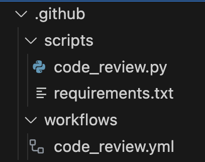
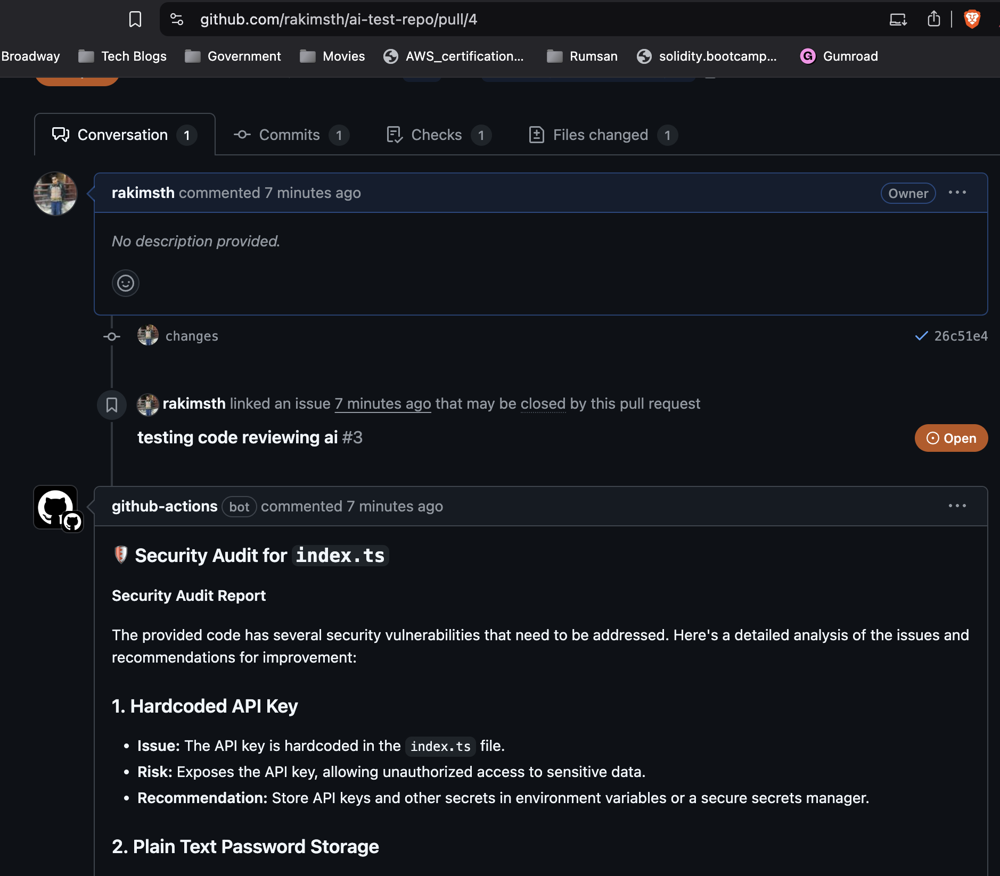

AI-powered code review agent using OpenAI SDK with OPEN ROUTER and GitHub Actions

## Features
1. Detect security vulnerabilities using Open Router Models using OpenAI SDK.
2. Change into any models as per your preference. (Check line 59 in the code_review.py)
3. Identify common security issues (e.g., SQL injection, hardcoded secrets, unvalidated input).
4. Post security warnings on the PR if issues are found.


## How It Works
1. Triggered on a PR update.
2. Fetches changed files (only .js, .ts, .py, .java, .sol for security audit).
3. Sends the code to OpenRouter Models using OpenAI SDK for security analysis.
4. Identifies vulnerabilities, including:
    - SQL Injection
    - Hardcoded credentials
    - XSS vulnerabilities
    - Insecure API usage
5. Posts security findings as a comment on the PR.

## How to use it

1. You'll need an OpenRouter API key with will use latest OpenAI o3 mini for free. Store it as a GitHub secret.
2. Go to GitHub Repo → Settings → Security → Secrets and Variables → Actions → Repository secrets.
3. Add a new secret named `OPENROUTER_API_KEY`.
4. Go to GitHub Repo → Settings → Code and automation → Actions → General → Workflow permissions
5. `Enable` Read and write permissions
6. Add the github workflow in any of your project as shown in the image




NOTE >> Follow the example shown in this [repo](https://github.com/rakimsth/ai-test-repo)

## Demo

Check this [Link](https://github.com/rakimsth/ai-test-repo/pull/4)



# Development

## Setup
Create a virtual environment:

```
python -m venv env
```

Activate the virtual environment:

```
source env/bin/activate
```

```
pip install -r requirements.txt
```

## Environment Configuration
Configure all the directories properly. Make sure all of them have proper read and write permissions.

```
cp .env.example .env
```
